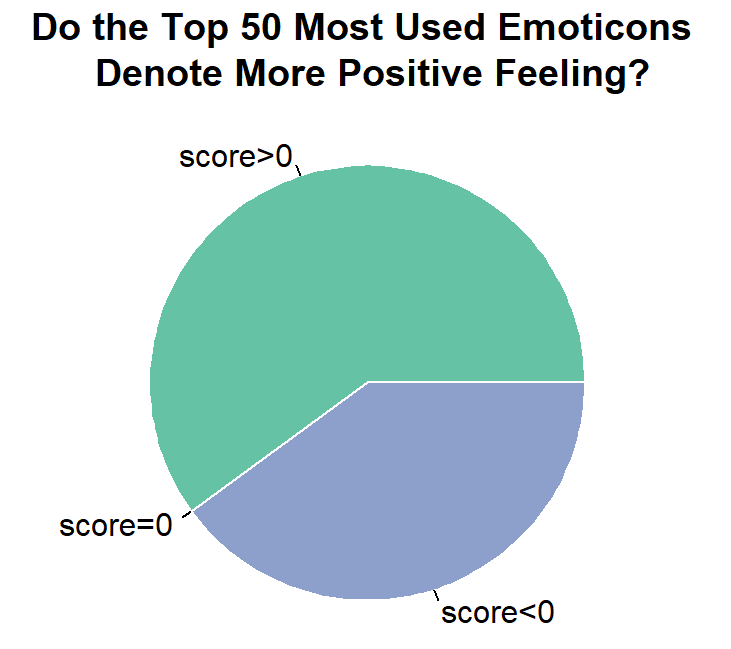
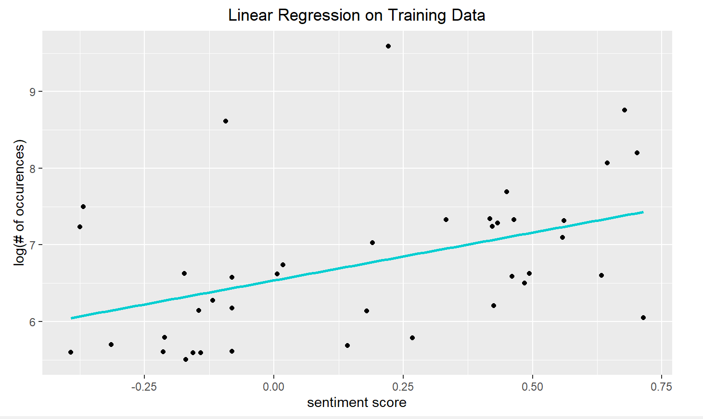

# DS4002-M3
---

## Table of contents
1. [INTRODUCTION](#introduction)
2. [HYPOTHESIS](#hypothesis)
3. [SRC](#src)
4. [DATA](#data)
5. [FIGURES](#figures)
6. [REFERENCES](#references)

---

## INTRODUCTION
In “Differences in Emoji Sentiment Perception between Readers and Writers”, an experiment was conducted that looked at the emoji sentiment of authors versus
that of writers. Berengueres and Castro found that readers and writers broadly agree on the sentiments of emojis. The largest discrepancy between readers and writers occurs for negative emojis, such as the sad face emoji. We would like to see how emoji sentiment perception differs from country to country [1].
Even though emojis are widely used to provide a reaction through digital communication, it is still better to keep in mind that some meanings of emojis are not universally accepted. The team would like to analyze the sentiment of the top 50 most used emojis in the world. 

---

## HYPOTHESIS
In the top 50 most used emojis in the world, at least 50% of them denote more positive feelings than negative feelings, with a sentiment score above 0 on a scale from -1 to 1. Additionally, the correlation between the popularity of emojis and their sentiment scores are greater than 0.5. 

---

## SRC
 

### Installing/Building Code
First, one must make sure that R and RStudio are installed on their system. Then, you can download the script from our src folder, along with the dataset in the data folder. Make sure that the files are saved into the same directory and change the working directory to where the files are located. Finally, you can click run to view the outputs of the code locally.

### Usage of Code
One would want to use our code to replicate and verify our results, or to possibly run further analysis on our dataset.

---
## DATA

---

## FIGURES

### **Figures Table**
* Modified Data Table
* Pie Chart - Do the Top 50 Most Used Emoticons Denote More Positive Feeling?
* Scatter plot - The Correlation of Sentiment Scores and Occurences
* Linear Regression Model

### **Data Set - Modified:**

The data set is modified so that it only contains information for each emoticon. An emoticon, short for "emotion icon", is more widely used to express one's feeling.

### **Pie Chart:**

To analyze whether or not at least 50% of the top 50 most used emoticons denote more positive feelings than negative feelings, we first made a pie chart. It is quite surprising to see that there are no emoticons with a sentiment score of 0. However, from the result, we can conclude that at least 50% of them have sentiment scores greater than 0 on a scale from -1 to 1, which means that they are more commonly used accompanied with positive texts. 

### **Scatterplot:**

The scatterplot shows the log(number of occurences) of each emoji on the y-axis, with the sentiment score that each emoji received on the x-axis. This allows us to visualize which emojis portray positive sentiments and which ones protary negative sentiments. Also, based on the graph, it seems like there is a correlation between two varaibles, which leads to further investigation.

### **Linear Regression Model:**

The graph shows the result of the linear regression analysis on the tranining data. Training data are selected randomly from the full dataset. The x-axis has the sentiment score associated with the test value, and the y-axis has the log(number of occurrences) for each sentiment score. 

The equation of trained linear regression model is log(occurences) = 1.25 * sentiment_score + 6.537. The mean standard error conducted on the testing data is 0.87. iF the MSE value is less than 1, the model is accurate, and the closer the MSE value is to 0, the more perfect a model is. 

---

## REFERENCES
## links to MI 1 and 2
https://github.com/Lychee030/DS4002-M3/blob/main/M3-2%20Data%20Analysis.pdf
