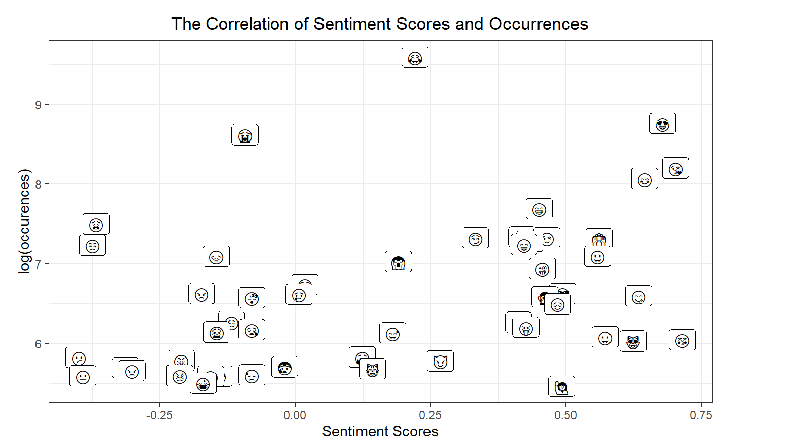
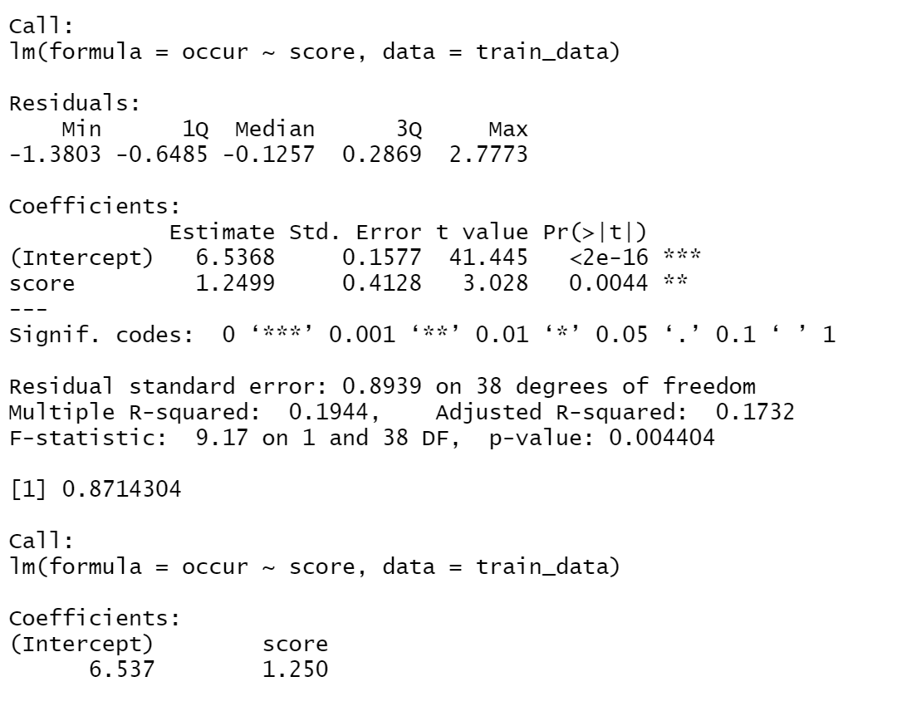

# DS4002-M3
---

## Table of contents
1. [INTRODUCTION](#introduction)
2. [HYPOTHESIS](#hypothesis)
3. [SRC](#src)
4. [DATA](#data)
5. [FIGURES](#figures)
6. [REFERENCES](#references)

---

## INTRODUCTION

---

## HYPOTHESIS

---

## SRC
 

### Installing/Building Code

### Usage of Code

---
## DATA

---

## FIGURES

### **Figures Table**
* Modified Data Table

### **Data Set - Modified:**

The data set is modified so that it only contains information for each emoticon. An emoticon, short for "emotion icon", is more widely used to express one's feeling.

### **Pie Chart:**

### **Scatterplot:**

The scatterplot shows the log(number of occurences) of each emoji on the y-axis, with the sentiment score that each emoji received on the x-axis. This allows us to visualize which emojis portray positive sentiments and which ones protary negative sentiments. Also, based on the graph, it seems like there is a correlation between two varaibles, which leads to further investigation.

### **Linear Regression Model:**

The graph shows the result of the linear regression analysis on the tranining data. Training data are selected randomly from the full dataset. The x-axis has the sentiment score associated with the test value, and the y-axis has the log(number of occurrences) for each sentiment score. 

The equation of trained linear regression model is log(occurences) = 1.25 * sentiment_score + 6.537. The mean standard error conducted on the testing data is 0.87. iF the MSE value is less than 1, the model is accurate, and the closer the MSE value is to 0, the more perfect a model is. 

---

## REFERENCES
